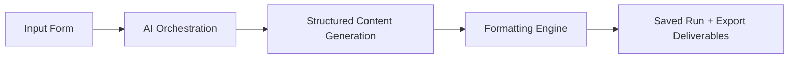

# AI Real Estate Content Engine

A portfolio-grade AI automation app that turns a short real estate agent brief into a full 30-day social media campaign, then packages the result into clean review and export workflows.

Built to be easy to demo and credible under inspection, the project combines a polished Next.js frontend with typed AI orchestration, schema-validated structured output, local run persistence, and multi-format exports.

## What It Does

From a compact input form, the app generates:

- A 30-day content calendar
- 30 post captions
- 10 carousel outlines with slide-by-slide text
- 10 short-form video scripts with hook, body, and CTA
- Hashtags for each post
- Optional image prompts for design generation
- Downloadable markdown, JSON, HTML, Google Docs, and print-friendly report outputs

## Why This Matters

This project demonstrates a practical AI workflow instead of a thin prompt wrapper:

- It reduces manual content planning from hours to minutes
- It keeps audience, niche, tone, and CTA visible across the full workflow
- It produces reviewable and exportable deliverables, not just raw model text
- It shows real automation system design: provider abstraction, prompt isolation, formatting, persistence, and delivery

## Feature Highlights

- Premium SaaS-style dashboard and generation workflow
- Demo mode that works without external API keys
- Claude-ready provider integration behind a service layer
- Prompt logic separated from route handlers
- Strict Zod schemas for inputs and generated outputs
- Results workspace with tabs, filters, and copy-to-clipboard actions
- Local history page powered by saved JSON runs
- Architecture page that explains the workflow in business language
- Export support for markdown, JSON, HTML, Google Docs, and browser PDF via print view

## Architecture Overview

The system is intentionally easy to explain in a portfolio review:



Implementation layers:

- `app/api/generate` validates the request and triggers generation
- `lib/ai` selects demo mode or Claude
- `lib/prompts` stores reusable prompt instructions outside route handlers
- `lib/formatting/plan.ts` converts raw output into polished deliverables
- `lib/storage/runs.ts` persists completed runs locally
- `lib/export` turns saved plans into markdown, JSON, HTML, and print-ready output

## Portfolio Highlights

- Strong end-to-end demo story: input, generation, review, history, export
- Clear evidence of automation design, not just UI polish
- Safe demo mode for recruiters or client walkthroughs with no API dependency
- Business-facing deliverables that are easy to screenshot and explain
- Structured codebase with reusable TypeScript types and utilities

## Stack

- Next.js 16 App Router
- React 19
- TypeScript
- Tailwind CSS 4
- Zod
- Anthropic SDK
- Local filesystem JSON persistence

## Project Structure

```text
app/          Pages and API routes
components/   UI primitives, form flows, results views
lib/          AI providers, prompts, formatting, storage, exports, types
data/         Sample brief, sample generated run, local run storage
docs/         Portfolio notes, demo script, screenshot checklist, case-study assets
scripts/      Demo data generation utilities
```

## Local Setup

### Prerequisites

- Node.js 20+
- npm 10+

### Install and Run

```bash
git clone https://github.com/DevCalebR/ai-real-estate-content-engine.git
cd ai-real-estate-content-engine
npm install
cp .env.example .env.local
npm run seed:sample
npm run dev
```

Open [http://localhost:3000](http://localhost:3000).

Recommended first demo path:

1. Open `/generate`
2. Click `Load Sample Brief`
3. Generate the monthly plan
4. Review the results tabs
5. Open the Exports tab or Print View

## Environment Setup

The app reads these variables from [.env.example](./.env.example):

```env
AI_PROVIDER=demo
CLAUDE_API_KEY=
CLAUDE_MODEL=
GOOGLE_DOCS_SHARE_MODE=anyone_with_link
GOOGLE_DOCS_SHARE_EMAIL=
GOOGLE_DOCS_CLIENT_EMAIL=
GOOGLE_DOCS_PRIVATE_KEY=
```

## Demo Mode vs Claude Mode

### Demo Mode

`AI_PROVIDER=demo`

- Default mode
- No external credentials required
- Uses a local generator that still returns the same structured content contract
- Exercises the same formatting, storage, and export pipeline as live mode

Included sample assets:

- [data/sample-brief.json](./data/sample-brief.json)
- [data/sample-demo-run.json](./data/sample-demo-run.json)

### Claude Mode

`AI_PROVIDER=claude`

Required variables:

- `CLAUDE_API_KEY`
- `CLAUDE_MODEL`

How it works:

- The request flows through [lib/ai/providers/claude.ts](./lib/ai/providers/claude.ts)
- Prompt instructions live in [lib/prompts/content-plan.ts](./lib/prompts/content-plan.ts)
- Raw AI output is parsed into strict JSON and normalized by the formatting layer

If Claude mode is selected but the configuration is incomplete, the UI surfaces the issue clearly and generation fails safely.

## Google Docs Export

The Google Docs export creates a brand-new Google Doc for a generated run, formats it with headings and section grouping, and returns the document URL to the UI so the user can open it immediately.

Included sections:

- Project summary / brief
- Monthly content calendar
- Captions grouped by day/post
- Carousel outlines
- Video scripts
- Hashtag recommendations
- Image prompts

Required setup:

- Enable the Google Docs API
- Enable the Google Drive API
- Create a service account
- Add the service account email and private key to `.env.local`
- Choose a share mode

Configuration notes:

- The app validates the service-account email and private key before enabling export
- Quoted keys with escaped `\n` newlines are supported
- Use the full `private_key` value from the Google JSON key file, not `private_key_id`

Recommended demo setup:

- `GOOGLE_DOCS_SHARE_MODE=anyone_with_link` for the fastest open-link demo
- `GOOGLE_DOCS_SHARE_MODE=share_with_email` plus `GOOGLE_DOCS_SHARE_EMAIL=you@example.com` if you want the created doc shared directly to one account

Fallback behavior:

- If Google credentials are not configured, the Google Docs export button stays disabled and explains why
- If the private key is malformed or truncated, the app treats Google Docs export as unavailable and shows the configuration issue directly in the UI
- Markdown, HTML, JSON, and print exports still work normally

## Export Features

Each completed run can be exported as:

- Markdown for readable documentation and internal handoff
- JSON for structured reuse or downstream automation
- HTML report for polished presentation
- Google Docs for an editable cloud document with returned open link
- Print-friendly view for browser PDF export

Export builders:

- [lib/export/markdown.ts](./lib/export/markdown.ts)
- [lib/export/html.ts](./lib/export/html.ts)
- [lib/integrations/google-docs.ts](./lib/integrations/google-docs.ts)

## Documentation Assets

- [docs/PORTFOLIO_NOTES.md](./docs/PORTFOLIO_NOTES.md)
- [docs/DEMO_SCRIPT.md](./docs/DEMO_SCRIPT.md)
- [docs/SCREENSHOT_CHECKLIST.md](./docs/SCREENSHOT_CHECKLIST.md)
- [docs/SHIP_READINESS_REPORT.md](./docs/SHIP_READINESS_REPORT.md)
- [docs/CASE_STUDY_BLURB.md](./docs/CASE_STUDY_BLURB.md)
- [docs/GOOGLE_DOCS_SETUP.md](./docs/GOOGLE_DOCS_SETUP.md)
- [docs/INTEGRATIONS.md](./docs/INTEGRATIONS.md)

## Future Enhancements

- Regenerate a single post without rebuilding the full month
- Editable output fields before export
- Reusable saved client profiles
- Stronger platform-specific formatting variants
- Database-backed multi-client storage
- Server-side PDF generation

## Verification

Verified locally with:

```bash
npm run lint
npm run seed:sample
npm run build
```
